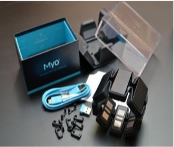

# GestureBasedProjectUsingMyoBand
### Dead on Rails
Author: Emil Parvanov

#### Purpose of the application:
#####  Goals :
###### The goal of this project was designing an augmented reality rails shooter that incorporates voice and gestures to create project that depended on interactive tools too create an enjoyable experience for all users.

#### Menu:

Above you can see the layouts of the starting menu in which the user uses a microphone too input the spoken commands too call and activate the respective feature.

#### Gameplay:

Above are images from early in development, you can see the armband-controlled weapon, crosshairs, zombie enemy as well as the ammo display and place holder for the score text. Beside this is Bezier path out line which shows the path the player will be moving upon.

Above is the game in the more polished state with the user having collided and stopped at one of the zombie spawn points, the ammo is displayed in the bottom right corner of the second image, the particle effects of the bullets and the gun firing.

# Hardware used in creating the application
#### Myo-ArmBand
##### What is this:
The Myo armband is a gesture controller that triggers a variety of actions on the computer based on the contractions of your muscles and the movements of your arm. That is has been used for presentations, video games, interacting with applications such as YouTube. It comes up with a pre-set of gestures which is rotate, closed first, open hand, wave left, wave right, double tap.  

 The Myo Armband also has an  [2] inertial measurement unit that uses an accelerometer and gyroscope to track the movement of the hand which can be translated into the movement of characters hand in a video game or the cursor of a mouse on pc.
#### Why was it used ?
 Although many augmented reality technologies in one way or another could have been used to develop this application, it was after reviewing some of our possible options such as the oculus rift, leap motion controller and Kinect we determined the Myo Armband too be the best candidate.

[3] The Kinect utilises a video camera, depth sensors  and a multi-array microphone. The conjunction of video camera and depth sensors to produce can track the players movements and the multiple microphones remove background noise and isolate the user’s voice. Now given that is project is a rails shooter with voice commands the isolation of the voice would have been of benefit but given that this game is pathed the need to track users’ limbs would have been restricted too the arms. This would have   meant the both the Kinect would have added a lot of unnecessary over-head that would not be utilized in the application as well as the need for the user to be in full view which by this games design would not have been a comfortable nor optimal way of engaging with this game.

      

[4] The oculus  device features to display screens for the user too view the world,  a gyroscope, accelerometer, and magnetometer which are all combined via sensor fusion to track your head and display the world with two hand controllers to interact with the world. Now this would  make a great choice from an immersion perspective but using the controllers we felt that using controllers does not give the desired impact, the capacity too control the aiming and using gestures foo fire felt like a much less restrictive experience. Another factor is that the path the user takes is not completely on axis coincided with the fact that the path goes upwards, downwards, sideways diagonal etc. This  would risk giving the user motion sickness which would completely ruin the experience of said game.

[5] The leap motion controller features two cameras with infrared that use wide angle lens to create a space for detecting motion of hands, it also utilizes a software that removes background objects and lightening to  build the display image. An algorithm is then used to match this filtered data to the hands and generate the model of the hand that gets displayed. This was a close contender for the device but fell short due to some limitations. This study concluded two things that would have made it a difficult device for this project, the fact the user will be moving the hand across a relatively wide area for shooting, the further the hand is from the device the more inaccurate its readings become, and the hands must stay relatively in the same place which would limited the capacity of the player too aim. It also had a limitation of inconsistent performance with real systems, with the user needing to gesticulate in real time and  varying times in response could be the difference between a user obtaining or not obtaining gun, killing an enemy and dying or killing an enemy and not dying.
      

The Myo Armband hardware was discussed above, but the reason it was selected was it offered the largest range of motion in the hand. out of the other devices which perfectly fit the needs for our shooting system, the tracking of the actual hand synced near perfectly too the crosshairs. The actual gesture recognition was accurate with minimal miss identifications. A less tangible benefit was the feel of controlling the weapon with the arm and using the gestures too fire and interact made for a very responsive and pleasant feeling in game.
      

# Gestures identified as appropriate for this application
###### Weave in - pick up

 The primary object the user will be picking up is a gun. The movement of the hand to pick up dropped gun is a weave motion  with a curled grip to pick it up off. It was a choice between the closed fist or weaving in motion, the weaving in motion was selected as one slight limitation of the Myo Armband is the flexes of the fingers in the open-hand and closed hand gesture can cause an incorrect classification, leading to the user firing instead of picking the gun up, or picking the gun up instead of firing.

#### Sensors too aim

This was the most straight forward decision for attaching behaviour too the user input. The coordinates for the hand movement directly translates to an aiming system which no other gesture or form of input but would have suited for aiming. .   
   

#### Weave out – reload
  
Part of a tactical reload is the rapid discarding of a magazine to insert a new magazine into a weapon, now the weave out gesture may not accurately the full motion, but movement of the hand outwards as well as an infrequent need to reload made this gesture seem like the logical choice for a functionality.
   

####  Pinch – calibration  

The pinch gesture often associated with zooming, also has ties in calibration. A lot of tools physical tools used for calibration contain two little grips that make the pinching motion. We felt then that it was the most suited for the calibration of the armband. This calibration process it to sync the x, y, z values too the application too ensure theirs no input delay and the movement translates properly too in-game
   

#### Open hand – shoot

 Be it throwing a rock, launching a knife, or firing an arrow, for all projectiles at the end of the throw the hand must be released to a degree and although in game a gun is used to fire your hand behaves as if it’s the gun, rather than you’re controlling the gun with your hand. Your hand is what’s launching the projectile so for this reason we took inspiration from the gesture associated with the release of something. The only caveat is the release seems to be a smaller gesture in the items listed above but the open hand is still the closest gesture to a release mechanism for the armband.

# Architecture for the solution Gestures

#### Bezier Path
[12]The Bezier Path was an asset used to create the rails aspect of the rail’s shooter. It contains a line which can be extended out and a path follower script too allow the player too to go along the path. There is anchor at control points, at any point you want to change the direction of the path you create an anchor and then use a control point to manipulate the angle, used any time a player goes up, goes down, goes left or goes right.
#### Random Weapons
(How this was supposed  to work)The Random Weapon is generated at an approximate halfway point in the game. A collider triggers stopping the disabling the path follower script temporarily, the user can ten spend points from their score too open a chest with a loot table that contains a list of weapons with a corresponding weight (drop chance) an item holder script that displays the item once the chest is opened.
#### Health bar
The health bar uses a filled image type which allows for a depletion script, its based off a health value kept of the screen for display purposes. It then uses Colour. Lerp method that as the user takes damage fades the health from green too red until death.  

#### Enemies
The enemies consist of zombies which are in idle states until the player is within a certain range then enter an attack state. There is various colliders on the zombie that when they collide with the player, the player will take varying amounts of damage. They are spawned via collision. When the user enters a collision at fixed points the path follower script is disabled the zombies start spawning. For the user too progress they must kill a determined number of zombies, which grant them a score and allow progress.  

#### Voice commands

The voice commands are as follows. When the user has a microphone when the user speaks start game, the game starts, if the user says main menu, it loads the menu. Each keyword above is associated with a command that does exactly as the keywords describe.

#### Conclusions & Recommendations
To conclude we feel like we accomplished the goal of creating an AR controlled rails shooter with a fun and responsive interface. Some of the most difficult work was not in the development of the project, but more so in research process of determining what hardware best suited the application, parsing out the relevant gestures and determining what functionality they were best suited too in order too create both a comfortable and logical process for interacting with the menus and the game. Some recommendations for this project would have been too limit the scope of the project to allow for a more full experience and focus on the lengthening the playable content rather than the addition of excess features so the user gets too spend more time in the world rather then limited exposure too each feature
>>>>>>> e2513de (late uploading of the project)
